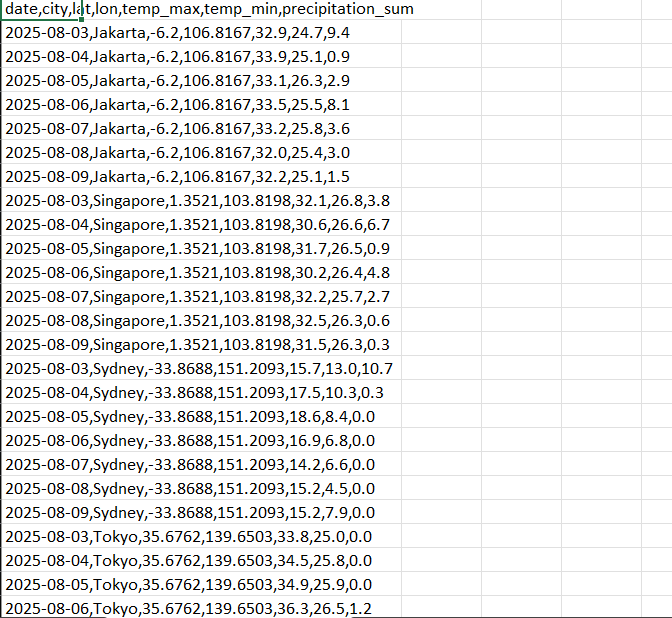

# 🌤️ API Data Fetcher (Open‑Meteo)

Fetcher data cuaca harian (7 hari) untuk beberapa kota **tanpa API key** menggunakan Open‑Meteo API.
Cocok sebagai bagian dari pipeline: **Fetch → Clean → Dashboard**.

## ▶️ Cara Menjalankan
```bash
python -m venv .venv
.venv\Scripts\activate
pip install -r requirements.txt
python src/main.py
```
## 📊 Output Example

